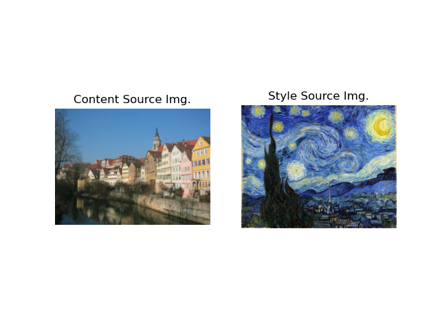
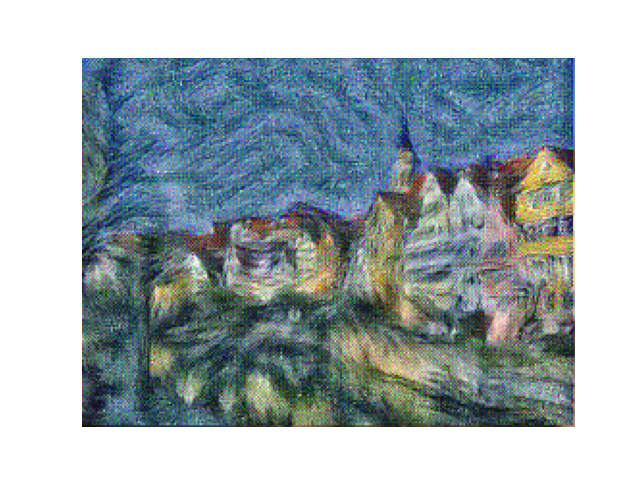

# Deep-Learning-for-Visual-Recognition
 
This repository includes three assignments of CS7643 Deep Learning course at GeorgiaTech.

<div align=center><div align=left>

See the projects description and the [report](assignment3/report-a3-cpeng78.pdf) for details.


## Projects Description: 
- **Assignment 1**: [Multi-layer Perceptron](assignment1). Deep Neural Networks are becoming more and more popular and widely applied to many ML-related domains. In this assignment, a simple pipeline of training neural networks was completed to recognize MNIST Handwritten Digits. Two newral network architectures, a simple softmax regression and a two-layer multi-layer perceptron, were implemented along with the code to load data, train and optimize these networks. See the [report1](assignment1/report-a1-cpeng78.pdf) for summarized experimental results and findings.

- **Assignment 2**: [Convolutional Neural Networks](assignment2). Convolutional Neural Networks (CNNs) are one of the major advancements in computer vision over the past decades. In this assignment, a simple CNN architecture is build from scratch. I also implement CNNs with the commonly used deep learning framework [Pytorch](https://pytorch.org/). Different experiments were run on imbalanced version of CIFAR-10 datasets to evaluate the model and techniques such as Class-Banlanced Focal Loss to deal with imbalanbced data. See the [report2](assignment2/report-a2-cpeng78.pdf) for details of the network design and experiment results.

- **Assignment 3**: [Network Visualization and Style Transfer](assignment3). In the Network Visualization part, we will explore the use of different type of attribution algorithms, both gradient and perturbation, for images, and understand their differences using the [Captum](https://captum.ai/) model interpretability tool for PyTorch. A Saliency Maps was first implemented from scratch as an exercise. Then four different network visualization techniques are explored with Captum package, the Saliency Maps, the GradCAM, the Fooling Images, and the Class Visualization. The second part is Style Transfer which closely relates to image gradient. The style transfer has become a cool application in deep learning with computer vision. See [report](assignment3/report-a3-cpeng78.pdf) for detailed results.

## Dependencies for Running Locally:

The projects are in Python (version 3.8), and rely heavily on a few important libraries.

To create an environment for these projects:
```
conda env create --file environment.yaml
```
Activate the new environment:
```
conda activate cs7643
```
The list of library provided in the conda environment format:
```
name:
cs7643
dependencies:
  - numpy
  - pyyaml
  - matplotlib
```
